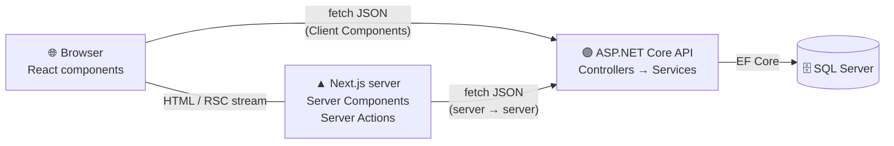

## What you will build

The finished app: Next.js front end, ASP.NET Core API, SQL Server database.

```mermaid
flowchart LR
  B["🌐 Browser<br/>React components"] -- "fetch JSON<br/>(Client Components)" --> API
  B -- "HTML / RSC stream" --- N["▲ Next.js server<br/>Server Components<br/>Server Actions"]
  N -- "fetch JSON<br/>(server → server)" --> API["🟣 ASP.NET Core API<br/>Controllers → Services"]
  API -- "EF Core" --> DB[("🗄️ SQL Server")]
```

